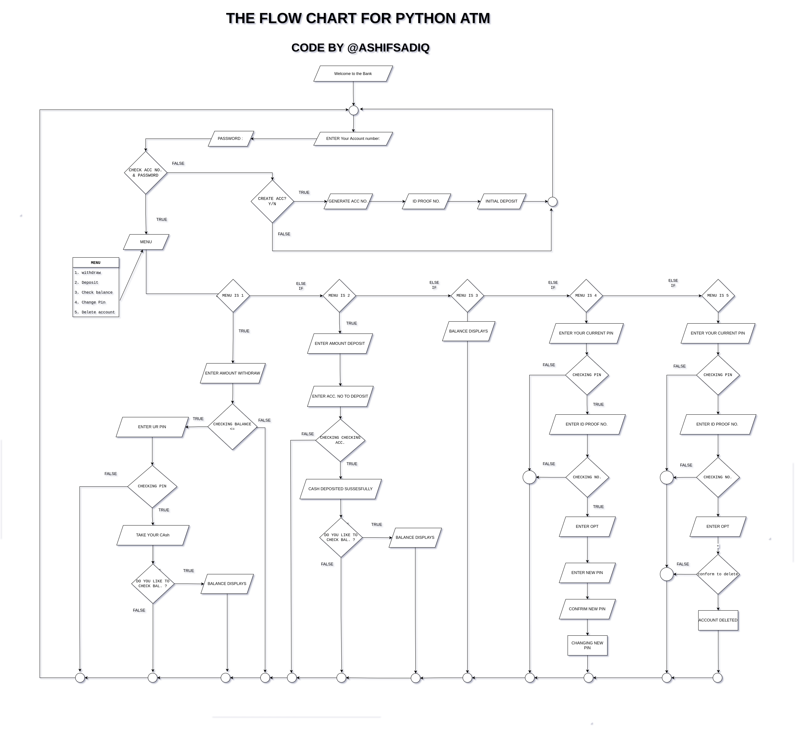

<h1 align="center"> Python ATM </h1>
<p align="center">  </p>
<p align="center"> <b> While ( ! ( succed = try ( ) &nbsp) ) ; </b> </p>
<br>

# Quick RUN
```
sudo apt-get install -y git
```
```
git clone https://github.com/ashifsadiq/pyATM.git
```
```
cd pyATM
```
```
sudo apt-get install -y python3
```
```
python3 main.py
```
<br>

## what does it do ?
<p align="center">  </p>